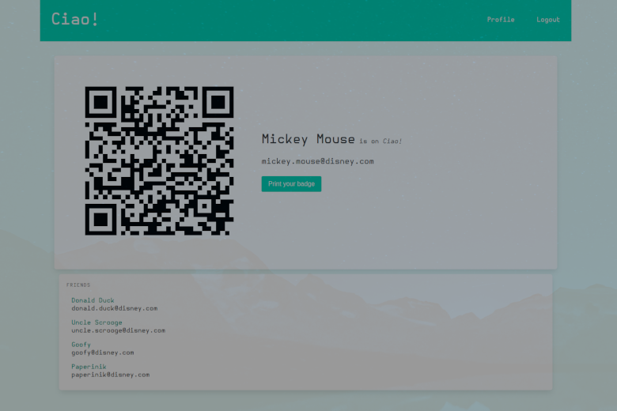

# Ciao!

_Ciao!_ allows people taking part in the same event to exchange contacts via QR
code. It is a lightweight, no-nonsense web application.



## Introduction

Before the event, you are to sign in with your credentials and print your badge.
Make sure to pin it on your chest: as you meet new people, they might want to
scan its QR code, or you could scan theirs. Either way, both of your email
addresses will be added to the other person's _Ciao!_ contact list.

## User setup

_Ciao!_ is a Node.js web application which relies on Node Package Manager.
Having both of them on your machine is required. While in this repository's root
folder, you can install the needed dependencies using

```bash
npm i
```

After that, you can start your web server with

```bash
DOMAIN=$DOMAIN PORT=$PORT SECRET=$SECRET npm start
```

where `$DOMAIN` is the domain linking to your server, `$PORT` is the port used
for connection, and `$SECRET` is used to sign the session ID cookies.
